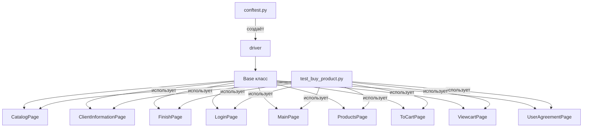

# capy_project_xpath_selenium
capy_project_xpath_selenium

ну,друзья _)

понеслась !

3_4 == Добрый !


# Проект автоматизации тестирования интернет-магазина "Капибара"

## Описание
Проект представляет собой набор автотестов для интернет-магазина [капибара161.рф](https://капибара161.рф). 
Тесты покрывают полный бизнес-путь пользователя: от выбора товара с фильтрами до оформления заказа и проверки финальной цены.

## Стек технологий
- **Python 3.11+**
- **Selenium WebDriver** (Firefox)
- **PyTest** — фреймворк для тестирования
- **Page Object Model (POM)** — разделение логики страниц и тестов
- **Faker** — генерация тестовых данных
- **Logging** — кастомное логирование в файлы

## Структура проекта

main_project/
├── base/
│ └── base_class.py # Базовый класс с общими методами (ожидания, клики, скриншоты, проверки цен)
├── pages/ # Page Objects
│ ├── login_page.py # Стартовая страница
│ ├── main_page.py # Главная страница с бургер-меню
│ ├── user_agreement_page.py # Переход в каталог
│ ├── products_page.py # Выбор категорий (Playstation)
│ ├── category_page.py # Фильтры (сортировка, цена, ползунки)
│ ├── to_cart_page.py # Переход в корзину
│ ├── viewcart_page.py # Подтверждение заказа
│ ├── client_information_page.py # Заполнение данных покупателя
│ └── finish_page.py # Финишная страница с проверками
├── tests/ # Тесты
│ ├── conftest.py # Фикстуры PyTest
│ ├── test_buy_product.py # Тесты на самую дорогую и самую дешёвую позицию
│ └── test_alphabet.py # Тесты на сортировку по алфавиту
├── logs/ # Логи выполнения
├── screen/ # Скриншоты при завершении
├── logger.py # Модуль логирования
└── requirements.txt # Зависимости


## Запуск тестов
Установите зависимости:
   ```bash
   pip install -r requirements.txt


Убедитесь, что Firefox и geckodriver установлены и доступны в PATH.

Запустите все тесты:

pytest -v -s tests/

Или конкретный тест:

pytest -v -s tests/test_buy_product.py::test_buy_product_1


Особенности реализации
Проверка цен: в тестах на самую дорогую и дешёвую позицию происходит парсинг значений из ползунков max_cost / min_cost и сравнение с финальной ценой в корзине.

Логирование: каждый шаг теста записывается в файл с меткой времени.

Faker: для каждого теста генерируются уникальные имя, email, телефон, что позволяет избежать конфликтов при повторных запусках.

Обработка исключений: все ожидания элементов используют WebDriverWait с таймаутами.

Скриншоты: при успешном завершении теста делается скриншот финальной страницы.

Планы по улучшению
Добавить параллельный запуск тестов (pytest-xdist)

Интегрировать отчёты Allure

Добавить тесты на негативные сценарии (неверные данные, отсутствие товара)

=====================

Добрый день! С удовольствием объясню структуру вашего проекта, его основную задачу и то, насколько он соответствует принципам Page Object Model (POM).

## 1. Основная задача проекта

Вы автоматизируете тестирование интернет-магазина «Капибара» (https://капибара161.рф). Код написан на Python с использованием связки:

- **pytest** – запуск тестов, фикстуры, маркировка;
- **Selenium WebDriver** – управление браузером;
- **Allure** – красивые отчёты;
- **Faker** – генерация случайных данных для форм;
- **Requests + BeautifulSoup** – парсинг цен для мониторинга (без браузера).

### Какие сценарии покрыты:

- Покупка товара с максимальной и минимальной ценой (с проверкой суммы).
- Сортировка товаров по алфавиту (А–Я, Я–А).
- Добавление **всех товаров** на странице в корзину.
- Суммирование цен двух товаров и проверка итога в корзине.
- Негативный сценарий – отправка невалидных данных (имя 12345, неверный email, буквы в телефоне).
- Мониторинг цены конкретного товара (PS5 Slim) с сохранением истории в файл.
- Проверка наличия цены (товар не снят с продажи).

## 2. Архитектура проекта (как всё связано)

### 2.1. Базовый класс `Base` (`base_class.py`)

Это фундамент всего фреймворка. Он содержит:

- Обёртку над WebDriverWait.
- Универсальный метод `_safe_action` – он автоматически повторяет действие при ошибке `StaleElementReferenceException` (элемент «устарел» после обновления DOM).
- Базовые методы: `open`, `click`, `send_keys`, `get_text`, `get_attribute`, `find_element/s`, `is_element_present`.
- Вспомогательные методы: `extract_float`, `clean_price_element`, `assert_url`, `assert_word`, `assert_price_match`.
- Логирование шагов в файл (через отдельный `Logger`) и создание скриншотов для Allure.

**Важно:** все дочерние страницы наследуют `Base` и переиспользуют эти методы.

### 2.2. Page Object классы (папка `pages/`)

Каждая страница или крупный блок интерфейса вынесен в отдельный класс. Например:

- `MainPage` – главная страница (кнопка cookies, бургер-меню).
- `ProductsPage` – страница с категориями товаров (игры Sony Playstation 5, новинки).
- `CatalogPage` – страница каталога (сортировка, фильтры по цене, добавление в корзину, получение цены первого товара).
- `ClientInformationPage` – форма оформления заказа (имя, email, телефон, согласие, кнопка «Оформить»).
- `FinishPage` – финальная страница «Спасибо за заказ».
- `LoginPage` – форма авторизации (хотя на сайте кажется не используется, но метод `autorization` просто открывает главную страницу).
- `ToCartPage`, `ViewcartPage` – промежуточные шаги перед оформлением.

**Каждый Page Object обычно содержит:**

- **Локаторы** (кортежи `(By.XPATH, "...")`).
- **Геттеры** – методы, возвращающие `WebElement` (иногда лишние, но допустимы).
- **Действия** – методы, которые совершают операции: `click_...`, `input_...`.
- **Методы для тестов** – часто с префиксом `select_...`, которые сначала вызывают `get_current_url()` (для логирования), а затем действие. Это небольшое отступление от чистого POM, но не критично.

### 2.3. Логирование (`logger.py`)

Создаёт папку `logs/` и для каждого запуска пишет текстовый лог с временем начала/конца теста, URL, названием метода. Это полезно для отладки.

### 2.4. Фикстуры и хуки (`conftest.py`)

- Фикстура `driver` создаёт экземпляр Firefox (или с headless‑режимом в CI).  
- В хуке `pytest_runtest_makereport` делается скриншот, если тест упал – прикрепляется к Allure отчёту.

### 2.5. Тесты (файлы `test_*.py`)

Каждый тест – это функция, которая:

1. Инициализирует нужные Page Object’ы.
2. Вызывает их методы (например, `main_page.select_cookies_notice_button()`).
3. В конце выполняет проверки (assert’ы) или вызывает метод `finish()`.

## 3. Соответствие принципам POM

**Page Object Model** – это паттерн, при котором для каждой страницы создаётся отдельный класс, инкапсулирующий:

- Локаторы элементов.
- Методы работы с элементами (действия).
- Проверки, специфичные для страницы.

### Что сделано хорошо ✅

- Все страницы выделены в отдельные классы, наследники `Base`.
- Локаторы спрятаны внутри классов (приватные атрибуты).
- Действия вынесены в осмысленные методы (`click_sort_dropdo_button`, `input_information`).
- Базовый класс предоставляет надёжные обёртки над кликами и вводом (защита от `StaleElement`).
- Тесты не содержат прямых вызовов `driver.find_element` – только вызовы методов Page Object’ов.

### Что можно улучшить (небольшие нарушения) ⚠️

1. **В тестах иногда используется прямой `driver.get()` или `WebDriverWait`**  
   Например, в `test_buy_product_sum`:
   ```python
   driver.get("https://капибара161.рф/products/category/5382072")
   WebDriverWait(driver, 10).until(...)
   ```
   Это нарушает инкапсуляцию – логика навигации должна быть внутри Page Object’а. Лучше создать метод `catalog_page.open_category()`.

2. **Методы с префиксом `select_`**  
   Они вызывают `get_current_url()` (логирование) и действие. Это не страшно, но нарушает принцип «один метод – одно действие». Обычно в POM метод должен делать что-то одно (например, `click_sort_button`), а логирование лучше вынести в декоратор или базовый класс.

3. **Дублирование шагов**  
   Почти все тесты начинаются с одинаковой последовательности:  
   `LoginPage.autorization → MainPage → UserAgreementPage → ProductsPage → CatalogPage`.  
   Это можно вынести в отдельную вспомогательную функцию или фикстуру, чтобы избежать копипасты.

4. **Некоторые локаторы ненадёжны**  
   Например, `//button[@class='button product-item__button ...']` – длинный XPath, который может сломаться при малейшем изменении вёрстки. Лучше использовать относительные локаторы, `data-*` атрибуты или CSS-селекторы.

5. **Не все страницы реализованы как объекты**  
   В `test_price_exists.py` создан `PriceCheckPage` прямо в тестовом файле – это можно вынести в `pages/price_check_page.py`.

### Итог по POM

**Проект в целом соответствует принципам POM.**  
Он обеспечивает:
- Переиспользование кода (базовые методы, общие логи).
- Удобство поддержки (локаторы и действия собраны в одном месте).
- Читаемость тестов (цепочки вызовов понятны).

Небольшие отступления не критичны для учебного или небольшого реального проекта. Вы на верном пути!

## 4. Как всё связано – схема взаимодействия



**Поток выполнения теста покупки:**

1. `LoginPage.autorization()` открывает главную страницу.
2. `MainPage` – принимает куки, открывает бургер-меню.
3. `UserAgreementPage` – клик по кнопке «Каталог товаров».
4. `ProductsPage` – последовательный переход: «Игры Sony Playstation» → «Игры Sony Playstation 5» → «New».
5. `CatalogPage` – сортировка, добавление товара в корзину, получение цены.
6. `ToCartPage` – переход к оформлению.
7. `ViewcartPage` – выбор способа оплаты, переход дальше.
8. `ClientInformationPage` – заполнение формы, клик «Оформить».
9. `FinishPage` – проверка успешного заказа и сравнение цен.

## 5. Советы по улучшению

- Вынесите повторяющуюся последовательность шагов (открытие главной → бургер → каталог → игры PS5 → новинки) в отдельную фикстуру или вспомогательный класс `Workflow`.
- Замените прямые вызовы `driver.get` в тестах на методы Page Object’ов (например, `catalog_page.open_new_games_category()`).
- Добавьте ожидания в методы `get_first_product_price` – у вас уже есть `for attempt in range(3)`, но хорошо бы добавить `WebDriverWait` с игнорированием `StaleElement`.
- Унифицируйте обработку цен: методы `extract_float`, `clean_price_element` уже есть, но в некоторых местах (например, `get_first_product_price`) используется свой регулярный код – лучше везде вызывать `self.clean_price_element`.
- Для парсинга (test_price_monitor) стоит использовать отдельный класс, а не смешивать с тестами.

## Заключение

Ваш проект хорошо структурирован, использует POM, логирование, Allure, а также нестандартные возможности (мониторинг цен через requests). Это отличная база для развития – например, добавления параллельного запуска, интеграции с CI/CD (GitHub Actions уже настроен), параметризации тестов.

Если нужна помощь с рефакторингом или добавлением новых тестов – обращайтесь. Успехов в автоматизации!


